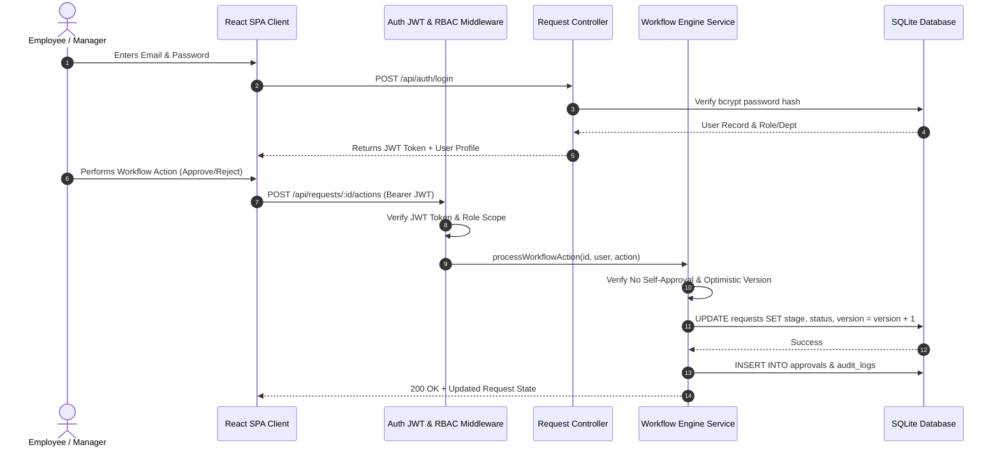
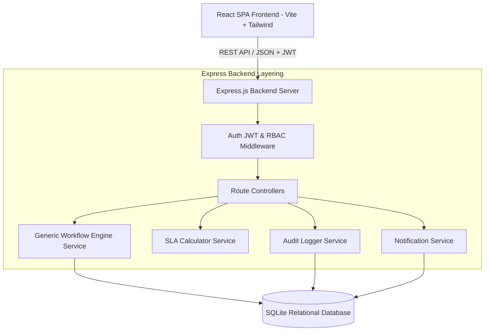
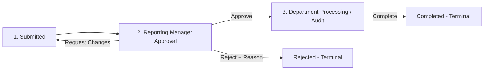
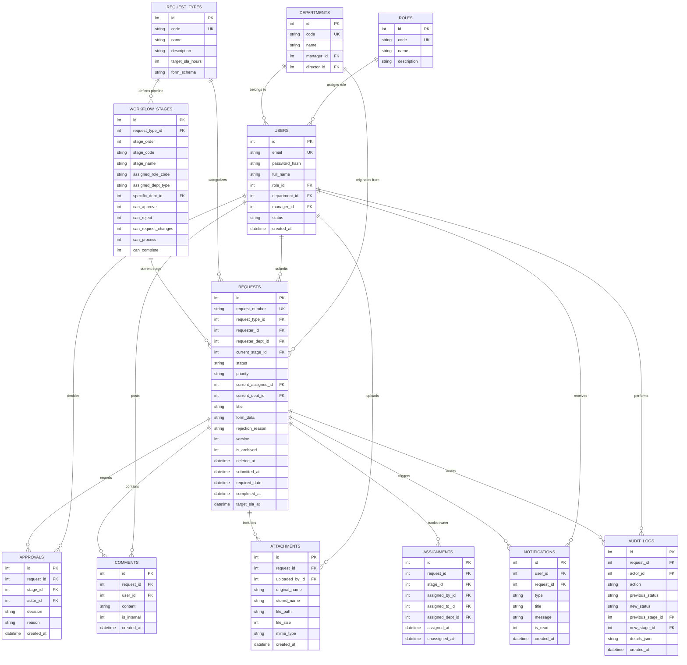

# WorkflowOps: Centralized Business Workflow & Operations Management Platform

[](https://nodejs.org/)
[](https://reactjs.org/)
[](https://expressjs.com/)
[](https://www.sqlite.org/)
[](https://jestjs.io/)

**WorkflowOps** is a production-quality, centralized enterprise workflow and operations management platform designed for a mid-sized organization (~500 employees). It replaces fragmented email threads, spreadsheets, and messaging channels with a single, unified request lifecycle engine supporting role-aware approvals, stage-based RBAC policies, dynamic form schemas, real-time SLA tracking, optimistic concurrency control, soft-delete historical retention, multi-tier operational dashboards, secure file attachments, and immutable audit logging.

---

## 1. Problem Understanding & Proposed Solution

### The Challenge
As organizations expand to ~500 employees across multiple departments (Engineering, Finance, IT, HR, Operations, Executive Leadership), internal service requests (software access, expense reimbursement, document sign-offs, equipment allocation) degrade into disconnected communication channels:
- Employees lack visibility into request status, current assignee, or approval delays.
- Reporting Managers struggle to identify requests requiring immediate review.
- Department Staff (IT, Finance, Procurement) lack centralized work queues and workload metrics.
- Management lacks operational analytics on turnaround times, department bottlenecks, and SLA breach rates.

### The Solution
Instead of four separate mini-apps, **WorkflowOps** provides **one common request-and-workflow engine**. All four core business processes flow through a single generic status lifecycle (`Submitted` → `Under Review` → `Approval Pending` → `Approved / Rejected` → `Processing` → `Completed`), backed by declarative workflow stage definitions, stage-aware security middleware, real-time timestamp SLA calculation, optimistic locking, and immutable audit logs.

---

## 2. Key Stakeholders & Role Matrix

The platform enforces Role-Based Access Control (RBAC) integrated with the **current stage** of the request workflow. Hiding UI buttons is never treated as security — the backend REST API independently authorizes every request.

| Role | Operational Responsibilities | Authorization & Workflow Scope |
|---|---|---|
| **Employee** | Create requests, submit form data, upload supporting receipts/documents, respond to clarification requests | Access own submitted requests. Cannot self-approve or process requests. |
| **Reporting Manager** | Review team members' requests, grant/deny approvals, request revisions/clarifications | Authorized to Approve, Reject, or Request Changes for direct reports or department team requests in manager review stages. |
| **Department Staff** | Process department work queues (IT account setup, Finance expense disbursement, Procurement asset allocation) | Authorized to Start Processing, Update Progress, and Mark Complete for requests assigned to their department queue. |
| **Department Head / Director** | Executive sign-off for high-value reimbursements, strategic document approvals, or senior escalation | Authorized to review and make decisions on director-stage approvals. |
| **Operations Manager** | Monitor organization-wide workload, SLA compliance rates, process bottlenecks, and department throughput | Global read-only analytics scope across all departments and workflows. |
| **System Administrator** | Provision users, manage department structures, configure workflow stage definitions, adjust SLA targets, soft-delete requests | Full administrative privileges for platform configuration and governance. |

---

## 3. Technology Stack & Architectural Justification

- **Frontend:** React 18 SPA (Vite, React Router DOM v7, Tailwind CSS, Lucide React icons).
- **Backend:** Node.js + Express.js layered architecture (`Routes` → `Controllers` → `Services` → `Data Layer`).
- **Database:** SQLite (embedded relational database via `better-sqlite3` with strict Foreign Key constraints, version locking, and JSON schema support).
- **Auth & Security:** JWT (JSON Web Tokens), bcryptjs password hashing, Multer file upload validation, stage-aware RBAC middleware.
- **Testing:** Jest + Supertest integration test suite (13/13 tests passing).

---

## 4. System Architecture & Auth Flow





---

## 5. Generic Workflow Engine & Data Model

All four mandatory business processes run through the single unified engine:



### Supported Mandatory Business Processes
1. **Software Access Request (Target SLA: 24h):**
   - `Employee` → `Reporting Manager` → `IT Administrator Processing` → `Completed`
2. **Expense Reimbursement (Target SLA: 48h):**
   - `Employee` → `Reporting Manager` → `Finance Verification` → `Reimbursement Disbursement` → `Completed`
3. **Document Approval (Target SLA: 72h):**
   - `Employee` → `Department Manager` → `Director Approval` → `Executive Sign-off` → `Completed`
4. **Equipment Request (Target SLA: 72h):**
   - `Employee` → `Reporting Manager` → `IT Availability Check` → `Procurement Allocation` → `Completed`

---

## 6. Entity-Relationship (ER) Schema (12 Tables)



---

## 7. Complete REST API Endpoint Specification

| Endpoint | Method | Required Role Scope | Request Body Shape | Response Shape |
|---|---|---|---|---|
| `/api/auth/login` | `POST` | Public | `{ email, password }` | `{ token, user }` |
| `/api/auth/me` | `GET` | Authenticated | None | `{ user }` |
| `/api/auth/users` | `GET` | Authenticated | None | `{ users: [...] }` |
| `/api/requests` | `GET` | Role Scoped | Query params (`search`, `request_type_id`, `status`, `priority`, `sla_status`, `scope`) | `{ requests: [...], count }` |
| `/api/requests` | `POST` | Employee | `{ request_type_id, title, priority, required_date, form_data }` | `{ request }` (201 Created) |
| `/api/requests/:id` | `GET` | Authorized Participant / Admin | None | `{ request, stages, approvals, comments, attachments, auditTrail }` (403 if unauthorized) |
| `/api/requests/:id/actions` | `POST` | Stage Assignee / Manager | `{ action, comments, reason, version }` | `{ message, request }` (409 on version conflict) |
| `/api/requests/:id` | `DELETE` | System Admin | None | `{ message, success: true }` (Soft deletes request) |
| `/api/requests/:id/comments` | `POST` | Request Participant | `{ content }` | `{ comment }` (201 Created) |
| `/api/requests/:id/attachments` | `POST` | Request Participant | Multipart `FormData` (`file`) | `{ attachment }` (201 Created) |
| `/api/requests/attachments/:id/download` | `GET` | Authorized Participant / Admin | None | File Download Binary Stream (403 if unauthorized) |
| `/api/dashboard/metrics` | `GET` | Authenticated | None | `{ metrics: { ... } }` |
| `/api/notifications` | `GET` | Authenticated | None | `{ notifications: [...], unreadCount }` |
| `/api/notifications/:id/read` | `PATCH` | Authenticated | None | `{ message }` |
| `/api/admin/overview` | `GET` | Admin / Ops Manager | None | `{ roles, departments, requestTypes, workflowStages }` |
| `/api/admin/users` | `POST` | System Admin | `{ email, password, full_name, role_id, department_id }` | `{ user, message }` (201 Created) |

---

## 8. Environment Variables & Setup Guide

### Local Development Setup from Fresh Clone

1. **Clone repository:**
   ```bash
   git clone <repository-url>
   cd business-workflow-platform
   ```

2. **Backend Setup (`/server`):**
   ```bash
   cd server
   npm install
   cp .env.example .env
   npm start
   ```

3. **Frontend Setup (`/client`):**
   ```bash
   cd ../client
   npm install
   cp .env.example .env.local
   npm run dev
   ```

Open browser at `http://localhost:3000`. Log in using any demo account (Password: `Password123!`):
- `aarav.sharma@company.com` (Employee)
- `rajesh.kumar@company.com` (Reporting Manager)
- `vikram.singh@company.com` (IT Staff)
- `neha.verma@company.com` (Finance Staff)
- `ananya.roy@company.com` (Director)
- `siddharth.patel@company.com` (Operations Manager)
- `admin@company.com` (System Admin)

---

## 9. Deployment Guide & Required Hosting Variables

### Backend Deployment (Render / Railway)
- **Root Directory:** `server`
- **Build Command:** `npm install`
- **Start Command:** `npm start`
- **Required Environment Variables:**
  - `PORT`: `5000` (or host provided port variable)
  - `NODE_ENV`: `production`
  - `JWT_SECRET`: `<your-random-secure-secret-key>`
  - `CLIENT_URL`: `https://your-frontend-domain.vercel.app` (Your deployed React client URL for CORS)

### Frontend Deployment (Vercel / Netlify)
- **Root Directory:** `client`
- **Build Command:** `npm run build`
- **Output Directory:** `dist`
- **Required Environment Variable:**
  - `VITE_API_BASE_URL`: `https://your-backend-service.onrender.com` (Your deployed Express API service URL)

---

## 10. Automated Testing Approach

Run Jest backend test suite:
```bash
cd server
npm test
```

### Complete Test Suite Results (13/13 PASSED)

| # | Test Description | Status | Verification Detail |
|---|---|---|---|
| 1 | Authentication & JWT Issuance | **PASS** | Validates user login, JWT signature, and role assignment. |
| 2 | Request Creation & SLA Computation | **PASS** | Creates equipment request with automatic SLA target date. |
| 3 | Prevent Self-Approval Enforcement | **PASS** | Rejects requester self-approval attempt with HTTP 400. |
| 4 | Mandatory Rejection Reason Rule | **PASS** | Blocks empty rejection reason with HTTP 400. |
| 5 | Invalid Status Transition Blockage | **PASS** | Blocks direct completion from early stage blocked. |
| 6 | Unauthorized Cross-User Access (403) | **PASS** | Returns HTTP 403 when user accesses unauthorized request. |
| 7 | Unauthorized Attachment Download (403) | **PASS** | Returns HTTP 403 when downloading unauthorized file. |
| 8 | Comments In-Thread Append | **PASS** | Posts clarification comment to thread with author details. |
| 9 | Optimistic Concurrency Control (409) | **PASS** | Returns HTTP 409 Conflict when stale version is submitted. |
| 10 | Manager Approval Progression | **PASS** | Advances request stage and updates status to `PROCESSING`. |
| 11 | Server-Side SQL Search & Filtering | **PASS** | Verifies database filtering by request type and status. |
| 12 | SLA Timestamp State Engine | **PASS** | Validates `WITHIN_SLA` and `OVERDUE` state computations. |
| 13 | Soft Delete & Audit Retention | **PASS** | Confirms `is_archived = 1` soft delete while retaining audit trail. |

---

## 11. Engineering Decisions & Architectural Justifications

### 1. Database Model Selection: Why Relational (SQL) over NoSQL?
- **Workflow State Consistency:** Workflow stage transitions require ACID transactional guarantees. In NoSQL document stores, updating a request stage while maintaining approval logs, comment threads, and attachment linkages introduces data drift risks.
- **Foreign Key Integrity:** Relationships between users, roles, departments, request types, and workflow stages rely on strict foreign keys.
- **Schema Enforcement with Metadata Flexibility:** Relational tables enforce system metadata, while workflow-specific dynamic form fields are cleanly encapsulated in structured JSON columns.

### 2. Scaling from 500 to 50,000 Employees

| Domain | 500 Employees (v1 Architecture) | 50,000 Employees (Enterprise Scale) |
|---|---|---|
| **Database** | Embedded SQLite with WAL mode | PostgreSQL Cluster with Primary/Replica topology & connection pooling (PgBouncer) |
| **Workflow Engine** | In-process Express Service Layer | Distributed Workflow Engine (Temporal / Camunda / Zeebe) |
| **Message Queue** | In-app DB Notification Table | RabbitMQ / Apache Kafka for asynchronous notification & audit ingestion streams |
| **File Attachments** | Local Disk Storage (`uploads/`) | Amazon S3 / Google Cloud Storage with Signed URLs and CDN caching |
| **Search & Analytics** | SQL Index Filtering | Elasticsearch / OpenSearch for full-text search and ELK analytics dashboards |
| **Authentication** | Local JWT & Bcrypt | Enterprise SSO / SAML 2.0 / OAuth2 (Okta, Azure AD / Entra ID) |

### 3. Handling User Department Transfers
When an employee transfers from one department to another (e.g., Engineering to Product Operations):
1. **Historical Audit Preservation:** Existing submitted requests retain their original `requester_dept_id` snapshot in the `requests` table. This ensures historical department budget reports, approvals, and audit trails remain 100% accurate for the period when the expense or access was incurred.
2. **Active Work Queue Transition:** Updating `department_id` in the `users` table seamlessly routes future request submissions to the new department manager, while pending approvals on past requests stay assigned to the original department queue.
